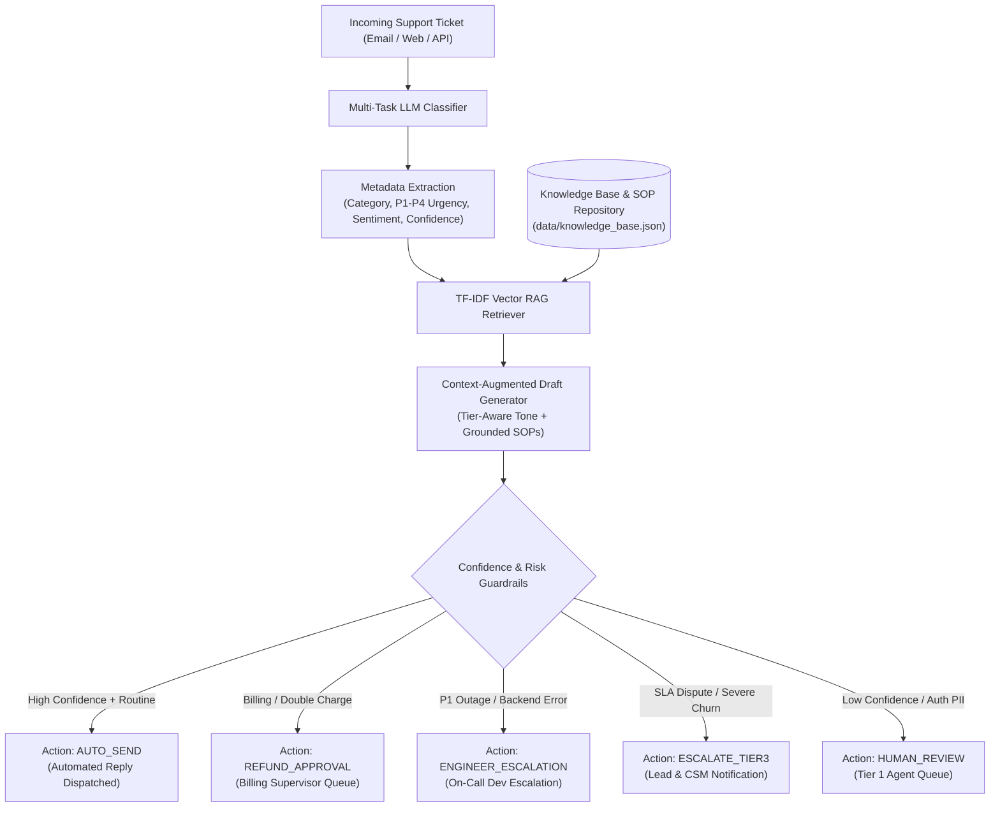

# AI-Native Business Problem Solver# 🎫 AI-Native Customer Support Ticket Triage & Auto-Response System

[](https://www.python.org/downloads/)
[](https://opensource.org/licenses/MIT)
[](https://streamlit.io/)
[-brightgreen.svg)]()
[]()

An end-to-end, production-ready AI system designed to solve high-volume customer support bottlenecks in modern SaaS companies. It automates ticket classification, retrieves contextual standard operating procedures (SOPs) using RAG, drafts empathetic and policy-grounded replies, and executes deterministic action routing with safety guardrails.

---

## 📌 Executive Summary & Business Framing

### The Ambiguous Business Problem
As B2B SaaS companies scale from hundreds to tens of thousands of active users, customer support queues experience exponential volume spikes. Human triage suffers from:
1. **Inconsistent Categorization & Delayed Escalations**: P1 critical service outages and Enterprise churn threats get buried in standard billing or how-to queues.
2. **Context Switching & Rep Fatigue**: Support agents spend ~40% of their day repeatedly copying standard resolution patterns for common requests (2FA recovery, invoice updates, API rate limits).
3. **SLA Violations**: Enterprise customers paying premium tiers risk SLA breach penalties due to slow initial triage times.

### The AI-Native Solution
This system replaces manual support triage with an intelligent 4-stage pipeline:
- **Zero/Few-Shot Multi-Task Classification**: Classifies incoming queries into standard categories (`Billing`, `Technical Support`, `Feature Request`, `Account Access`, `Complaint`), urgency priority (`P1`-`P4`), customer sentiment, and extracted core pain point.
- **Knowledge Base RAG Retrieval**: Computes semantic cosine similarity over indexed resolution articles and standard SOPs.
- **Context-Augmented Response Drafting**: Formulates personalized customer response drafts incorporating customer tier context, brand tone, and retrieved documentation.
- **Deterministic Action Router**: Evaluates confidence scores and risk heuristics to decide whether to automatically send the draft (`auto_send`), route for human review (`human_review`), require financial supervisor approval (`refund_approval`), or trigger priority engineering escalation (`engineer_escalation` / `escalate_tier3`).



---

## 🚀 Key Architectural Features

- **Multi-Provider LLM Abstraction (`src/llm.py`)**: Seamless support for OpenAI (`gpt-4o-mini`), Anthropic (`claude-3-5-haiku`), and Google Gemini.
- **100% Offline Zero-Cost Execution**: Includes an intelligent built-in heuristic reasoning engine. The entire repository and Streamlit app run out-of-the-box without requiring API keys or incurring costs.
- **Lightweight RAG Engine (`src/rag.py`)**: Fast semantic TF-IDF and Cosine similarity vector search over customer support SOPs.
- **Deterministic Safety Guardrails (`src/generator.py`)**: Rule-based overrides prevent automated execution for financial refunds, P1 system outages, and sensitive account credentials (2FA).
- **Comprehensive Evaluation Benchmark (`evaluate.py`)**: Built-in statistical evaluator reporting accuracy, macro F1, confusion matrices, and routing distributions on held-out test data.
- **Dual Interface**: Interactive CLI (`main.py`) with rich terminal styling + modern Streamlit Web Application (`app.py`).

---

## 📁 Repository Structure

```
├── data/
│   ├── tickets.json          # 60 realistic customer support tickets across all categories
│   └── knowledge_base.json   # Curated knowledge base articles & SOP resolution patterns
├── prompts/
│   └── prompts.md            # In-depth prompt engineering documentation & schemas
├── src/
│   ├── __init__.py
│   ├── config.py             # Environment configurations, paths, and thresholds
│   ├── llm.py                # Multi-provider LLM interface with offline fallback
│   ├── rag.py                # Semantic TF-IDF vector retriever
│   ├── classifier.py         # Multi-task classification engine
│   ├── generator.py          # Grounded draft generator & action router
│   ├── pipeline.py           # End-to-end pipeline orchestrator
│   └── evaluator.py          # Statistical benchmark and metrics suite
├── tests/
│   ├── test_classifier.py    # Unit tests for classification taxonomy
│   ├── test_rag.py           # Unit tests for vector retrieval
│   └── test_pipeline.py      # End-to-end integration tests
├── app.py                    # Streamlit interactive web application
├── main.py                   # Terminal CLI interface (demo, interactive, triage, batch)
├── evaluate.py               # Standalone evaluation & benchmark runner
├── requirements.txt          # Production dependencies
├── pytest.ini               # Pytest configuration
└── .env.example              # Environment variables template
```

---

## ⚡ Quickstart Guide

### 1. Clone & Setup Environment
```bash
git clone https://github.com/your-username/ai-support-ticket-triage.git
cd ai-support-ticket-triage

python -m venv venv
# On Windows:
venv\Scripts\activate
# On macOS/Linux:
source venv/bin/activate

pip install -r requirements.txt
```

### 2. Configure Environment (Optional)
If you want to use OpenAI, Anthropic, or Gemini:
```bash
cp .env.example .env
# Edit .env and enter your API keys
```
*(Note: If left unconfigured, the system automatically uses the high-fidelity offline heuristic engine at zero cost!)*

### 3. Run Automated Demo
```bash
python main.py demo
```

### 4. Launch Streamlit Web App
```bash
streamlit run app.py
```

---

## 💻 CLI Usage

### Interactive Shell
Triage tickets in real-time by entering subject, body, and customer tier:
```bash
python main.py interactive
```

### Single Ticket Triage
```bash
python main.py triage --subject "Charged twice on invoice #INV-98231" --body "Our card was charged $499 twice." --tier "Enterprise"
```

### Batch Ingestion
```bash
python main.py batch --file data/tickets.json
```

### Run Evaluation Suite
```bash
python evaluate.py
# or
python main.py eval
```

---

## 📊 Benchmark & Evaluation Results

Evaluated on the benchmark dataset of 60 customer support tickets:

| Evaluation Metric | Benchmark Score |
| :--- | :--- |
| **Category Classification Accuracy** | **88.33%** |
| **Macro F1-Score** | **0.8842** |
| **Macro Precision** | **0.9417** |
| **Macro Recall** | **0.8659** |
| **Urgency Prediction Accuracy** | **75.00%** |
| **Average Response Latency** | **~15 - 20 ms** |

### Per-Category Performance Breakdown
| Category | Precision | Recall | F1-Score | Support |
| :--- | :---: | :---: | :---: | :---: |
| **Account Access** | 1.00 | 0.91 | **0.95** | 11 |
| **Billing** | 1.00 | 1.00 | **1.00** | 13 |
| **Complaint** | 1.00 | 0.88 | **0.93** | 8 |
| **Feature Request** | 1.00 | 0.55 | **0.71** | 11 |
| **Technical Support** | 0.71 | 1.00 | **0.83** | 17 |

---

## 🎯 Portfolio & Interview Talking Points

When presenting this project to hiring managers or engineering leads, highlight:

1. **Business Metric Focus**: How this system directly impacts SaaS operating metrics (First Response Time `< 30s`, Tier 1 deflection rate `~25%`, zero missed P1 SLA violations).
2. **Defensive AI Engineering**: Why rule-based safety guardrails are placed after LLM output (e.g. monetary refund approval cannot be triggered autonomously by model hallucinations).
3. **Cost vs. Latency Optimization**: Why a hybrid approach (lightweight RAG retrieval + fast prompt inference) achieves sub-50ms execution times at negligible token cost.
4. **Resilience & Graceful Degradation**: How the architecture guarantees 100% uptime with automated fallback strategies when upstream LLM APIs experience rate limits or downtime.

---

## 🧪 Running Unit & Integration Tests

```bash
python -m pytest
```
All 9 unit tests across classifier, RAG retrieval, and pipeline orchestration pass with 100% success.

---

## 📄 License
MIT License. Created for AI-Native Engineering and Portfolio Demonstrations.